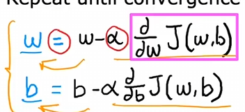
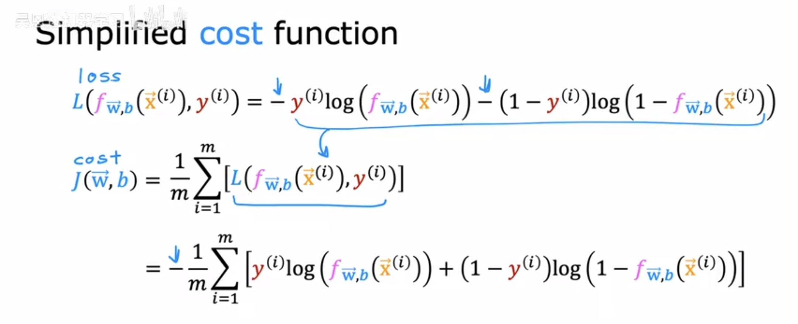

## 监督学习

定义：从给定的正确的输出学习输入到输出的映射关系，分为回归与分类。回归的输出是连续的、无限的，分类的输出个数是有限的

线性回归模型是回归模型的一个例子，以数字作为输出

### 梯度下降算法

学习率是梯度方向上的步长，梯度下降是同步更新的，也即求偏导的函数是同一个，不能更新完一个参数后再求一次偏导再更新参数

学习率过大会导致过冲，并且可能永远取不到最小值，过小则耗费时间过长

Adam算法可起到类似阻尼的作用，对学习率进行动态调整

特征缩放：当不同特征的取值范围差别过大时，可能造成梯度下降算法运行缓慢，通过将取值范围较大的特征值进行缩放，使各特征参数取值范围相当

三种特征缩放的方法

1. 特征值除以最大值
2. 均值归一化：（特征值-均值）/取值范围（也即最大值减去最小值）
3. z-score归一化：特征值-均值）/标准差

检测梯度下降算法是否有效运行：

图表法，横轴为运行次数，纵轴为代价函数（方差）

自动收敛测试，提前规定一个数，当某次迭代后代价函数下降值小于该数则宣布收敛

特征工程：通过自己的经验或知识对原有的特征进行组合变成新的特征并且加入到模型中，已达到使模型更有效的目的

### 逻辑回归模型

实际上可看作在线性回归上添加了一步，数学公式为f=1/(1+e^-z)，sigmoid函数，其中z就是线性回归模型得到的f，逻辑回归模型主要用于类的判别。在分类的情境下仍使用线性回归会有决策边界偏移的风险，从而导致预测的结果与实际差别很大

其实质是利用高阶多项式的组合将决策边界由普通的线性边界转换成了复杂边界

逻辑回归模型的损失函数

log图像举例

损失函数不选用平方误差是因为其图像不是凸函数，它有很多最小值，梯度下降算法会停留在局部最小值

逻辑回归模型的梯度算法形式与线性回归模型相同，不同之处在于f的定义改变了

过拟合与欠拟合：

另一种说法是高偏差与高方差，欠拟合意味着训练数据中有一个明显的模式但算法未能捕捉到，过拟合则意味着算法为了追求完美拟合数据导致训练出来的模型无法推广至其他数据，会与实际结果差别很大

减少过拟合的措施：

1. 增大数据集
2. 只保留关键特征（缺点是会丢失特征信息）
3. 正则化

正则化实质上是在同等地降低特征系数的绝对值，每一次迭代相当于乘以一个很接近1但小于1的系数，思路是避免系数很大的情况下单一特征的微小变动会导致输出结果很大波动的情况。但由于对每个特征的对结果贡献的权重不加区分，可能会产生问题？

正则化参数对于训练误差及交叉验证误差的影响如下：lambda很小相当于没有正则化，可能出现过拟合，lambda很大时，模型倾向于让参数保持很小，极限情况下会趋于b，也即拟合效果很差，高误差

softmak算法，作为在y的取值大于2的情况下对逻辑回归算法拓展，其实质是对输入数据做线性回归的基础上得到z，分子是ez，分母是各个ez地和

## 无监督学习

监督学习中数据同时包含输入x与输出标签y，相比之下无监督学习只包括输入x，不对输出进行标签，只是由算法自己找出数据中的相似的模式或结构

聚类（clustering）算法，类（cluster），也即是将具有相似属性的数据分到同一个簇中

异常检测（anomaly detection），

降维（dimensionality reduction），在尽可能少丢失信息的情况下将大数据集压缩成小数据集

## 基于tensorflow库的训练

步骤：

1. 指定模型，主要是层数，每层的神经单元数及激活函数
2. 编译模型，指定损失函数
3. 训练模型

损失函数、成本函数、代价函数的区分：

损失函数是单个预测值与实际值的误差

代价/成本函数是损失函数的加权平均值

激活函数及其常见使用：

线性函数，如果神经网络的隐藏层全部使用线性激活函数，那么最终输出也是线性函数，整个神经网络等同于一个大型线性模型，无学习能力

relu，隐藏层常采用，因为相比sigmoid图像之后一侧是平的，对于梯度下降算法来说效率更高，特点是输出大于等于0

sigmoid，逻辑回归，特点是输出有正有负，大多分布于-1～1之间

### 评估模型是否有效的两种方法：

一是将数据集分为训练集与测试集，分别计算训练集与测试集的平方误差，第二是利用训练后的模型对原始输入x进行预测，统计预测错误的数据比例

### 避免过于乐观估计的模型选择方法：

将数据集分为训练集、交叉验证集、测试集，训练集用于训练得到参数，交叉验证集用于选定模型，测试集用于对模型的误差作出评估

对模型效果的正确预期：

一种是与人类在该种任务中的表现比较，另一种是与具有相同功能的模型比较

### 增大训练集对于高偏差与高方差的影响：

对于高偏差，几乎没影响，直观理解是如果模型只是线性，再怎么增加数据都没用，这个时候是模型有问题，对于高方差，效果比较明显。

### 减少高偏差或高方差的措施

高偏差

增加特征，减小正则化参数

高方差

减少特征，增大数据集，增大正则化参数

### 数据增强的措施

有选择性地向现有数据加入噪音

合成数据（多用于计算机视觉）

迁移学习：在一个基于大量数据训练的模型的基础上进行改进与训练，例如保留参数，只训练输出层参数。优点是可以以较小的数据集取得较好的训练效果，如图像识别的预训练，原本是识别猫狗，自己想训练文字识别，那么可以在预训练模型的基础上进行训练。

